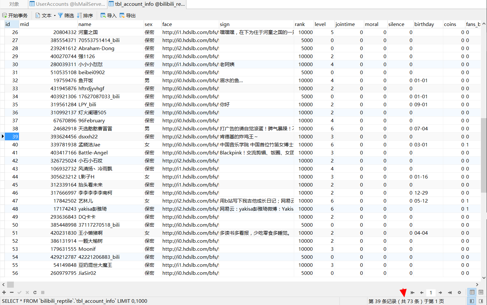
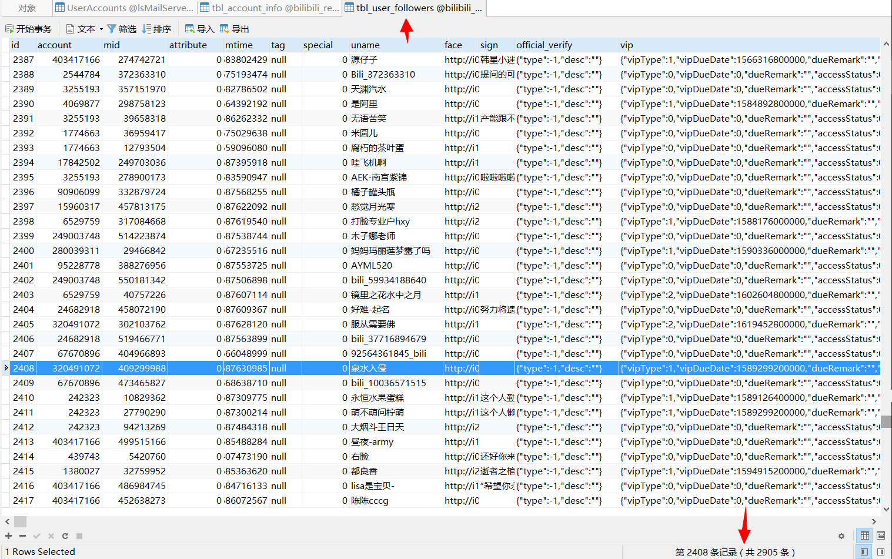

<p align="center">
<a href="https://space.bilibili.com/350937042" target="_blank"></a> 
<a href="https://142vip.cn" target="_blank"></a>
<a href="http://yapi.142vip.cn" target="_blank"></a>
<a href="https://blog.142vip.cn" target="_blank"></a>
<a href="https://github.com/mmdapl" target="_blank"></a>
<a href="https://gitee.com/mmdapl" target="_blank"></a>
<a href="https://blog.csdn.net/Mmdapl" target="_blank"></a>
</p>

基于Eggjs框架定时爬取B站用户相关数据进行存储分析，提供有效接口或grpc服务供外部使用。[部署说明](部署说明.md)

## 基本要求

- 本项目只是简要的爬取B站上相关接口信息，目的在于练手，若有兴趣，切勿用作从事废话活动，例如恶意攻击小破站（B站架构中有相关的熔断和削峰措施`劝退`）
- 为避免作者个人服务器等配置数据公开，分享的项目代码缺乏`config`及`Dockerfile`配置文件，且已尽力做好数据脱敏处理，**请大家理智学习，友善交流！**
- 若本项目对你有帮助，确实需要config等配置及数据库SQL等，便于项目运行及线上部署，**欢迎大家积极issues或star，我将第一时间提供相关代码。** 不过相信以上代码足够进行基础学习。哈哈哈哈~~~
- 既然看到这里了，请关注一下B站[Rong姐姐好可爱](https://space.bilibili.com/350937042)吧

## 爬取效果

- 个人信息



- 关注人信息



- 被关注人信息


## 数据量问题

从上面简单演示的爬虫效果截图可以看到，目前只是进行小范围的爬取，主要原因是：我本身就是一名up主，我不会伤害她的，haha~~如果你需要进行大数量爬取，建议：

- 结合代码逻辑，更换更加例如数据爬虫的语言--python，进行数据爬虫；
- 尝试绕过B站架构大佬的限流、熔断、削峰的措施；比如：使用**动态代理**、请求混淆、延时请求等措施；

**注意：此处的动态代理目前网上有的也很少，而且还不稳定，若需要稳定且丰富的代理ip，那就花钱吧~~**

## 项目接口

懒得写了~看相关router路由吧

```js
// 基础接口
router.get('/api/reptile/account', controller.search.getUpAccountInfo);
router.get('/api/reptile/following', controller.search.getUpFollowingsInfo);
router.get('/api/reptile/followers', controller.search.getUpFollowersInfo);

// 数据同步
router.get('/api/reptile/sync/followers', controller.search.reptileTotalFollowers);
router.get('/api/reptile/sync/followings', controller.search.reptileTotalFollowings);

// 是否正在关注
router.get('/api/reptile/isFollowing', controller.search.isFollowingBSiteUp);
```


## B站相关接口

#### 用户个人信息
- 接口：https://api.bilibili.com/x/space/acc/info
- 类型：GET
- 参数：
```bash
mid:B站用户id   --必须
jsonp:接口跨域，默认jsonp  --必须【建议了解一下jsonp跨域解决方案】
```
- 接口响应数据
```js
{
    "code": 0, // 接口状态码
    "message": "0", // 接口返回信息
    "ttl": 1, // 延迟，建议了解ttl
    "data": { // 数据对象
        "mid": 350937043, //B站id
        "name": "陳霂汁", // 昵称
        "sex": "保密", // 性别
        "face": "http://i0.hdslb.com/bfs/face/94873e26c86bbb3e087812c6558c5f65db10f09a.jpg", // 图像
        "sign": "", // 个签
        "rank": 10000, //权限范围 
        "level": 3, // 账号等级
        "jointime": 0,// 注册账号时间
        "moral": 0,
        "silence": 0,
        "birthday": "",// 生日
        "coins": 0, // B站硬币数
        "fans_badge": false, // 粉丝牌
        "official": { // B站官方账号属性
            "role": 0,
            "title": "",
            "desc": "",
            "type": -1
        },
        "vip": { // B站会员账号属性
            "type": 0,
            "status": 0,
            "theme_type": 0
        },
        "pendant": {
            "pid": 0,
            "name": "",
            "image": "",
            "expire": 0,
            "image_enhance": ""
        },
        "nameplate": { // 模板
            "nid": 0,
            "name": "",
            "image": "",
            "image_small": "",
            "level": "",
            "condition": ""
        },
        "is_followed": false,// 是否被关注
        "top_photo": "http://i2.hdslb.com/bfs/space/cb1c3ef50e22b6096fde67febe863494caefebad.png",// 个人主页顶部logo
        "theme": {}, // 主题
        "sys_notice": {} // 系统提示
    }
}
```
- 接口示例：
https://api.bilibili.com/x/space/acc/info?mid=208259&jsonp=jsonp

#### 用户关注人信息

- 接口：https://api.bilibili.com/x/relation/followings
- 类型：GET
- 参数：
```bash
vmid:B站用户id   --必须
pn:分页展示中，当前页  默认1 
ps:分页展示中，一页数据量，最大50，默认20,
order：时间字段的排序规则，desc降序，asc升序，类似于数据库中的排序；经过测试，order排序依赖于mtime字段，即用户关注他人时间戳
jsonp:接口跨域，默认jsonp  --必须【建议了解一下jsonp跨域解决方案】
```
- 接口响应数据
```js
{
    "code": 0,  // 接口状态码
    "message": "0",  // 接口返回信息
    "ttl": 1,  // 延迟，建议了解ttl
    "data": {  // 数据对象
        "list": [ // 具体关注人对象数组
            {
                "mid": 17174243, // B站账号
                "attribute": 0,
                "mtime": 1585924906,
                "tag": null, // 标签
                "special": 0,
                "uname": "yakisa彭雅琦", // 昵称
                "face": "http://i2.hdslb.com/bfs/face/0da1d54a6cfdb58ec3d982cc0e9d4fda6c953853.jpg", // 图像
                "sign": "网易云：yakisa彭雅琦\n微博：Yakisa彭雅琦\nQQ群号：824170579 \n微信号：yakisa0803\n\n喜欢五月天的创作歌手",// 个签
                "official_verify": { // 官方验证【判断是否为官方账号属性】
                    "type": -1,
                    "desc": ""
                },
                "vip": { // vip账号属性
                    "vipType": 2,
                    "vipDueDate": 1618329600000,
                    "dueRemark": "",
                    "accessStatus": 0,
                    "vipStatus": 1,
                    "vipStatusWarn": "",
                    "themeType": 0,
                    "label": {
                        "path": ""
                    }
                }
            }
        ]
        "re_version": 3394431374, // 数据版本，推测为数据库数据版本【例如常用分表、数据迁移、对数据进行版本扩充】
        "total": 17 // 关注人总数，可由此来配置pn、ps进行循环分页；
    }
 
}
```
- 接口示例：
https://api.bilibili.com/x/relation/followings?vmid=350937042&pn=1&ps=20&jsonp=jsonp&order=desc

#### 用户被关注人信息

- 接口：https://api.bilibili.com/x/space/acc/info
- 类型：GET
- 参数：
```bash
vmid:B站用户id   --必须
pn:分页展示中，当前页  默认1 
ps:分页展示中，一页数据量，最大50，默认20,
order：时间字段的排序规则，desc降序，asc升序，类似于数据库中的排序；经过测试，order排序依赖于mtime字段，即用户关注他人时间戳
jsonp:接口跨域，默认jsonp  --必须【建议了解一下jsonp跨域解决方案】
```
- 接口响应数据
```js
{
    "code": 0, // 接口状态码
    "message": "0",  // 接口返回信息
    "ttl": 1, // 延迟，建议了解ttl
    "data": { // 数据对象
        "list": [ // 具体关注人对象数组
            {
                "mid": 37730187,// B站账号
                "attribute": 0, // 标签
                "mtime": 1585206758,
                "tag": null,
                "special": 0,
                "uname": "歪果果果果仁", // 昵称
                "face":   "http://i0.hdslb.com/bfs/face/25ff68243f9690bc258df838149fdd074d16bbab.jpg",// 头像地址
                "sign": "",
                "official_verify": { // 官方验证【判断是否为官方账号属性】
                    "type": -1,
                    "desc": ""
                },
                "vip": {   // vip账号属性
                    "vipType": 2,
                    "vipDueDate": 1619798400000,
                    "dueRemark": "",
                    "accessStatus": 0,
                    "vipStatus": 1,
                    "vipStatusWarn": "",
                    "themeType": 0,
                    "label": {
                        "path": ""
                    }
                }
            }
        ]        ],
        "re_version": 823272565,  // 数据版本，推测为数据库数据版本【例如常用分表、数据迁移、对数据进行版本扩充】
        "total": 10448 // 关注人总数，可由此来配置pn、ps进行循环分页；
    }
}
```
- 接口示例：
https://api.bilibili.com/x/space/acc/info?mid=208259&jsonp=jsonp

#### 获赞量、阅读量、播放量

- 接口：https://api.bilibili.com/x/space/acc/info
- 类型：GET
- 参数：
```bash
mid:B站用户id   --必须
jsonp:接口跨域，默认jsonp  --必须【建议了解一下jsonp跨域解决方案】
```
- 接口响应数据
```js
{
    "code": 0, // 状态码
    "message": "0",
    "ttl": 1, // 延迟
    "data": { // 获赞量、阅读量、点击量
        "archive": { // 视频点击量
            "view": 3766739
        },
        "article": { // 文章阅读量
            "view": 6121809
        },
        "likes": 2503172 // 获赞量
    }
}
```
- 接口示例：https://api.bilibili.com/x/space/upstat?mid=208259&jsonp=jsonp


#### 关注量、被关注量

- 接口：https://api.bilibili.com/x/space/acc/info
- 类型：GET
- 参数：
```bash
mid:B站用户id   --必须
jsonp:接口跨域，默认jsonp  --必须【建议了解一下jsonp跨域解决方案】
```
- 接口响应数据
```js
{
    "code": 0, // 状态码
    "message": "0",
    "ttl": 1,
    "data": { // 关注量 被关注量数据
        "mid": 350937042, // up账号
        "following": 18, // 正在关注用户数量
        "whisper": 0,
        "black": 0, // 黑名单
        "follower": 10448 // 被关注量即粉丝数量
    }
}
```
- 接口示例：https://api.bilibili.com/x/relation/stat?vmid=208259&jsonp=jsonp


### 生产环境

```bash
$ npm i
$ npm run dev
$ open http://localhost:7921/
```

### 正式环境

```bash
$ npm start
$ npm stop
```

### docker部署
参考主目录下的Dockerfile文件，自行打包
```bash
# 安装node
FROM node:latest
# 标签
LABEL version="Beta@1.0"
LABEL description="Eggjs框架开发的定时爬取B站用户基础数据"
# 作者
MAINTAINER Taylor <2237221210@qq.com>
# 创建项目空间
RUN mkdir -p /web-project/node/bilibili-reptile
# 将当前代码文件复制到工作区域
COPY . /web-project/node/bilibili-reptile
# 进入 vendors
WORKDIR /web-project/node/bilibili-reptile
# 指定npm仓库
RUN npm install --registry https://registry.npm.taobao.org
EXPOSE 7921
# 项目启动 
CMD ["npm","run","start"]
```

执行命令进行打包，构建镜像
```bash
## 注意熟悉docker命令
docker build -t <镜像名:版本号> . 
```
镜像创建完成后，可以构建容器了，简单示例一下：
```bash

## 后台运行
docker run -d name bilibili -p 7921:7921 <镜像id>
```

### 友情链接

- 作者博客：[沉住气、慢慢来](http://blog.142vip.cn)
- 作者网站：[凡是过往、皆为序章](http://142vip.cn)`维修中`
- 授权平台：[Oauth2支撑平台](http://oauth2.142vip.cn)`测试中`

<p style="text-algin:right">时间：2020年4月20日 晚.</p>
